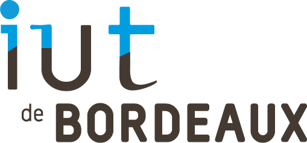
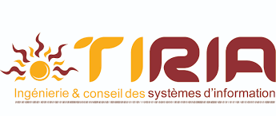

<h1 align="center">Louis Michault</h1>
<h3 align="center">I'm a computer scientist student from France at the Technical Universitary Institute of Bordeaux and I work for the company Tiria</h3>

  

<h3 align="left">Projects</h3>

I'm currently working on some personnal projects that you can find on this GitHub. If you want to see my school and others experiences you can go find them on <a href="https://louis-michault.fr" target="_BLANK">my website</a> or also on my <a href="https://www.linkedin.com/in/louis-michault/" target="_BLANK">LinkedIn</a> page.

<h3 align="left">School</h3>

I'm in the third year of computer science at the <a href="https://www.iut.u-bordeaux.fr/" target="_BLANK">Technical Universitary Institute of Bordeaux</a> in France and I work for the company Tiria.

